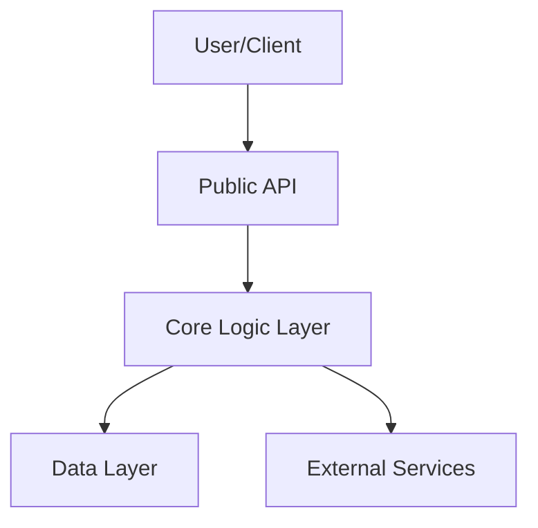
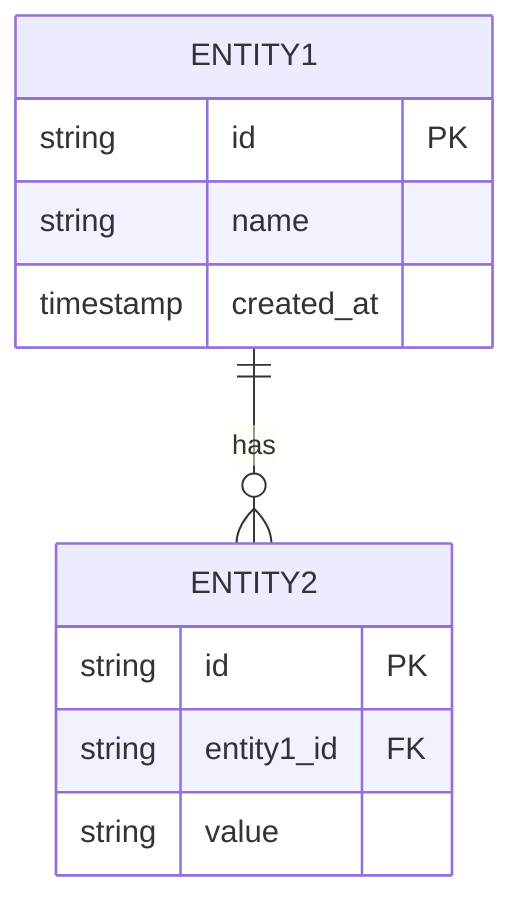
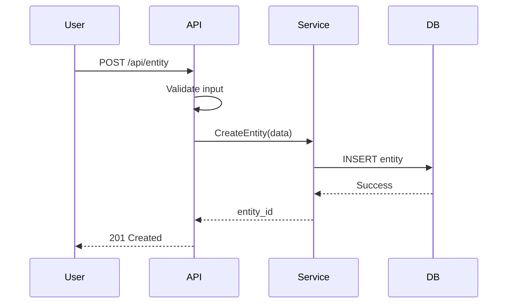

# 🏗️ Phase 2: DESIGN - Architecture Design

> **Role**: Principal Software Architect  
> **Objective**: Design system architecture, interfaces, and data models with clear tradeoffs  
> **Language**: English instructions, technical content in English, explanations can be bilingual

---

## Instructions for AI

**Core Principles**:
1. **Think Before Write**: Analyze domain, identify boundaries, evaluate tradeoffs
2. **Modularity**: Define public interface vs private implementation
3. **Visual Over Text**: Use Mermaid diagrams for complex flows
4. **Defensive Design**: Assume failures, define error states

---

## 0. 上下文和需求参考 (Context & Requirements Reference)

> **PREWORK**: `prework.md`  
> **REQUIREMENTS**: `requirements.md`

### 0.1 用户故事覆盖 (User Story Coverage - Traceability Matrix)

| User Story | Design Section | Component/API | Status |
|------------|---------------|---------------|--------|
| US-001 | Section 4.1 | `[Component/API name]` | ✅ Covered |

### 0.2 来自 PREWORK 的关键约束 (Key Constraints from PREWORK)

**MUST Follow** (from PREWORK Section 6):
1. 
2. 
3. 

---

## 1. 设计原理 (Design Rationale) - ADRs

### ADR-001: [Decision Title]

**Status**: 🟡 Proposed | 🟢 Accepted | 🔴 Rejected

**Context**: What problem prompts this decision?
- 

**Decision**: What change are we proposing?
- 

**Alternatives Considered**:

| Option | Pros | Cons | Verdict |
|--------|------|------|---------|
| Option A |  |  | ❌ Rejected |
| Option B |  |  | ✅ Selected |

**Consequences**: What becomes easier or harder?
- **Positive**: 
- **Negative**: 
- **Neutral**: 

### ADR-002: [Another Decision]

[Repeat format above]

### 关键挑战 (Key Challenges)

**What's the hardest part of this feature? How to solve it?**

1. **Challenge**: 
   - **Solution**: 

---

## 2. 架构和边界 (Architecture & Boundaries)

### 2.1 组件图 (Component Diagram)



**中文说明 (Explanation)**:
- 

### 2.2 依赖关系 (Dependencies)

**Upstream** (Who calls us?):
- 

**Downstream** (Who do we call?):
- 

**Blast Radius** (What breaks if this changes?):
- 

---

## 3. 数据模型 (Data Model)

### 3.1 Schema Definitions

**Language**: Use project's language (Go structs, TypeScript interfaces, Python dataclasses, etc.)

```go
// Example for Go project
// File: internal/domain/entity.go

type Entity struct {
    ID        string    `json:"id" db:"id"`
    Name      string    `json:"name" db:"name"`
    CreatedAt time.Time `json:"created_at" db:"created_at"`
    // Add indexes: CREATE INDEX idx_entity_name ON entity(name)
}
```

### 3.2 实体关系图 (Entity Relationship Diagram)



### 3.3 数据验证规则 (Data Validation Rules)

| Field | Type | Constraints | Validation |
|-------|------|------------|------------|
| `id` | string | Required, Unique | UUID v4 |
| `name` | string | Required, Max 100 chars | Alphanumeric + spaces |

---

## 4. 接口规范 (Interface Specification)

### 4.1 Public API

**API Type**: REST / GraphQL / gRPC / tRPC

#### Endpoint: [Method] /api/path

**Request**:
```json
{
  "field": "value"
}
```

**Response** (Success):
```json
{
  "success": true,
  "data": {}
}
```

**Response** (Error):
```json
{
  "success": false,
  "error": {
    "code": "ERROR_CODE",
    "message": "Human readable message"
  }
}
```

**Status Codes**:
- `200 OK`: Success
- `400 Bad Request`: Invalid input
- `401 Unauthorized`: Authentication required
- `403 Forbidden`: Insufficient permissions
- `404 Not Found`: Resource not found
- `500 Internal Server Error`: Server error

### 4.2 Function Signatures

**Language**: Use project's language

```go
// Example for Go
// File: internal/service/entity_service.go

type EntityService interface {
    Create(ctx context.Context, entity *Entity) error
    GetByID(ctx context.Context, id string) (*Entity, error)
    Update(ctx context.Context, entity *Entity) error
    Delete(ctx context.Context, id string) error
}
```

---

## 5. 核心逻辑和流程 (Core Logic & Flows)

### 5.1 关键路径：[Scenario Name]

**Sequence Diagram**:



**中文说明 (Flow Explanation)**:
1. 
2. 
3. 

### 5.2 伪代码实现 (Pseudocode Implementation)

```python
# High-level pseudocode (language-agnostic)

def create_entity(input):
    # 1. Validate input
    if not validate(input):
        return error("Invalid input")
    
    # 2. Check permissions
    if not has_permission(current_user, "create_entity"):
        return error("Forbidden")
    
    # 3. Business logic
    entity = build_entity(input)
    
    # 4. Persist to database
    try:
        entity_id = db.insert(entity)
    except DuplicateError:
        return error("Entity already exists")
    
    # 5. Return success
    return success(entity_id)
```

---

## 6. 安全和非功能需求 (Security & Non-Functional Requirements)

### 6.1 边缘情况 (Edge Cases)

| Scenario | Expected Behavior |
|----------|------------------|
| Empty input | Return 400 Bad Request |
| Duplicate entry | Return 409 Conflict |
| Concurrent updates | Use optimistic locking |

### 6.2 安全性 (Security)

**Authentication**:
- Method: 
- Token storage: 

**Authorization** (RBAC):
- Roles: 
- Permissions: 

**Input Sanitization**:
- Validation: 
- Escape: 

### 6.3 性能 (Performance)

**Optimization Strategies**:
- **Caching**: 
- **Indexing**: 
- **N+1 Prevention**: 

**Load Estimates**:
- Expected RPS: 
- P95 latency target: 
- Database queries per request: 

### 6.4 可观测性 (Observability)

**Logging**:
- What to log: 
- Log level: 

**Monitoring**:
- Key metrics: 
- Alerts: 

---

## 7. 验证策略 (Verification Strategy)

### 7.1 单元测试 (Unit Tests)

| Test Suite | Target | Key Scenarios |
|-----------|--------|--------------|
| `EntityService.test` | `EntityService` | CRUD operations, validation |

**Example Test Cases**:
- ✅ `test_create_entity_success`
- ✅ `test_create_entity_duplicate_error`
- ✅ `test_get_entity_not_found`

### 7.2 集成测试 (Integration Tests)

| Test Suite | Target | Key Scenarios |
|-----------|--------|--------------|
| `entity_api.test` | `/api/entity/*` | Auth, error handling, database |

### 7.3 端到端测试 (E2E Tests)

| Test Case | User Flow | Expected Result |
|-----------|-----------|----------------|
| TC-001 | Create → Read → Update → Delete | Full entity lifecycle works |

---

## 8. 回滚策略 (Rollback Strategy)

**Feature Flag**:
- Flag name: `FEATURE_[NAME]_ENABLED`
- Default: `false`
- Rollout: Gradual (10% → 50% → 100%)

**Database Migration Rollback**:
- Migration file: `[timestamp]_add_entity_table.up.sql`
- Rollback file: `[timestamp]_add_entity_table.down.sql`
- Tested: ✅ Yes / ❌ No

**API Compatibility**:
- Breaking changes: ✅ Yes / ❌ No
- Versioning strategy: 

---

## 9. 文件清单 (File Manifest) 🔴 CRITICAL FOR PLAN

### 9.1 创建的文件 (Files to Create)

| File Path | Type | Purpose | Dependencies |
|-----------|------|---------|--------------|
| `internal/domain/entity.go` | Model | Entity definition | None |
| `internal/service/entity_service.go` | Service | Business logic | domain/entity.go |
| `internal/handler/entity_handler.go` | Handler | HTTP handlers | service/entity_service.go |

### 9.2 修改的文件 (Files to Modify)

| File Path | Change Type | Description |
|-----------|------------|-------------|
| `internal/router.go` | Add routes | Register entity endpoints |
| `migrations/001_init.sql` | Add table | Create entity table |

### 9.3 具体类型定义 (Concrete Type Definitions)

**For PLAN**: Copy these directly into implementation

```go
// File: internal/domain/entity.go
package domain

import "time"

type Entity struct {
    ID        string    `json:"id" db:"id"`
    Name      string    `json:"name" db:"name" binding:"required,max=100"`
    CreatedAt time.Time `json:"created_at" db:"created_at"`
    UpdatedAt time.Time `json:"updated_at" db:"updated_at"`
}

func (e *Entity) Validate() error {
    // Validation logic
    return nil
}
```

### 9.4 API 签名 (API Signatures)

**For PLAN**: These are exact function signatures to implement

```go
// File: internal/service/entity_service.go
package service

import (
    "context"
    "calibre-api/internal/domain"
)

type EntityService struct {
    // dependencies
}

func NewEntityService() *EntityService {
    return &EntityService{}
}

func (s *EntityService) Create(ctx context.Context, entity *domain.Entity) error {
    // Implementation in PLAN phase
    return nil
}

func (s *EntityService) GetByID(ctx context.Context, id string) (*domain.Entity, error) {
    // Implementation in PLAN phase
    return nil, nil
}
```

---

## 10. 模块分解 (Module Decomposition)

**Only use when Complexity=High or Design Type=Multi-Module**

### Submodule 1: [Name]
- Scope: 
- Dependencies: 
- Interface: 

### Submodule 2: [Name]
- Scope: 
- Dependencies: 
- Interface: 

---

## QA Checklist: DESIGN Architecture Review

### SOLID-DST Model

#### 0. **S**tructure Compliance 🔴 CRITICAL

- [ ] Section 0: Context & Requirements Reference (with traceability matrix)
- [ ] Section 1: Design Rationale (ADRs)
- [ ] Section 2: Architecture & Boundaries
- [ ] Section 3: Data Model
- [ ] Section 4: Interface Specification
- [ ] Section 5: Core Logic & Flows
- [ ] Section 6: Security & NFRs
- [ ] Section 7: Verification Strategy
- [ ] Section 8: Rollback Strategy
- [ ] Section 9: File Manifest (files, type definitions, API signatures)

#### 1. **S**chema & Data Modeling

- [ ] **Normalization**: DB schema properly normalized?
- [ ] **Relationships**: Relationships correctly defined?
- [ ] **Indexes**: Key query fields indexed?
- [ ] **Scalability**: Can handle expected data volume?

#### 2. **O**ver-engineering Check (KISS)

- [ ] **Complexity Justification**: New infrastructure (Redis, queues) truly needed?
- [ ] **YAGNI**: No "for future" fields or parameters?
- [ ] **ADR Quality**: ADRs properly documented with alternatives?

#### 3. **L**ogic & Flows

- [ ] **Race Conditions**: Sequence diagram considers concurrent requests?
- [ ] **Error Handling**: Failure states defined?
- [ ] **Idempotency**: Operations safely retryable?

#### 4. **I**nterface Design (API)

- [ ] **Naming Standards**: API names follow `verb + noun` pattern?
- [ ] **Input Validation**: Strict enough validation?
- [ ] **No Leakage**: API doesn't return sensitive data?

#### 5. **D**ependencies & Boundaries

- [ ] **Coupling**: Modules don't directly import from other features?
- [ ] **No Circular Dependencies**: Dependency graph is acyclic?

#### 6. **D**efense (Security)

- [ ] **Authorization**: Each endpoint explicitly checks permissions?
- [ ] **No Injection**: Avoiding raw queries?

#### 7. **S**tate Management

- [ ] **Source of Truth**: Clear what lives in URL vs server vs local state?

#### 8. **R**ollback & Recovery

- [ ] **Rollback Plan**: Documented and tested?
- [ ] **Feature Flags**: For risky changes?
- [ ] **Migration Safety**: DB migrations reversible?

#### 9. **T**est Strategy

- [ ] **Test Coverage**: Verification strategy detailed?
- [ ] **E2E Coverage**: Critical flows covered?

#### 10. **T**raceability

- [ ] **User Story Mapping**: Section 0.1 maps all user stories?
- [ ] **Requirements Coverage**: Every Gherkin scenario verifiable?

#### 11. **P**LAN Readiness 🔴 CRITICAL

- [ ] **File Manifest Complete**: Section 9 lists all files?
- [ ] **Type Definitions Concrete**: Provided in project language?
- [ ] **API Signatures Precise**: Can be directly copy-pasted?
- [ ] **No Ambiguous Decisions**: PLAN doesn't need to decide architecture?

### QA Verdict

**Status**: ⚪ Not Started | 🟡 In Progress | 🔴 Rejected | 🟡 Needs Revision | 🟢 Approved

**Issues Found**:
- 

---

## Phase Completion

**DESIGN Status**: ⚪ Not Started | 🟡 In Progress | 🟢 Complete | 🔴 Needs Revision

**Next Action**: After QA passes, advance to PLAN phase

**Verification**: 
- ✅ All user stories covered by design
- ✅ File manifest complete and concrete
- ✅ ADRs documented for major decisions
- ✅ Ready for PLAN phase (no ambiguity)

---

**Phase Transition**: When complete and QA approved, AI should:
1. Update spec frontmatter: add DESIGN to `phase_history` with status APPROVED
2. Update spec frontmatter: set `phase` to PLAN
3. Ask user: "DESIGN approved. Proceed to PLAN phase?"

