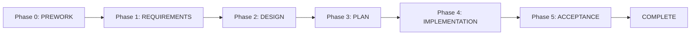

# AI Agent Instructions

## Project: calibre-api

Calibre API 是一个基于 Go 的书籍管理系统，集成了语义搜索、智能问答和 MCP 协议支持。

## 📚 项目文档导航

**核心指南**:
- `CLAUDE.md` - 完整的 AI 助手开发指南（架构、代码规范、开发流程）
- `specs/` - 功能规格文档（使用 LeanSpec 管理）
- `app/AGENTS.md` - 前端开发指南（Vue.js 3）

**规格文档**:
- `specs/007-000-project-overview/` - 项目概览和架构
- `specs/001-book-management/` - 书籍管理功能
- `specs/002-search-functionality/` - 搜索功能（混合搜索策略）
- `specs/003-mcp-integration/` - MCP 协议集成
- `specs/004-chat-agent/` - 智能问答
- `specs/005-qdrant-vector-search/` - 向量搜索
- `specs/006-task-management/` - 异步任务管理

## 🚨 CRITICAL: Before ANY Task

**STOP and check these first:**

1. **Discover context** → Use `board` tool to see project state
2. **Search for related work** → Use `search` tool before creating new specs
3. **Never create files manually** → Always use `create` tool for new specs

> **Why?** Skipping discovery creates duplicate work. Manual file creation breaks LeanSpec tooling.

## 🔧 Managing Specs

### MCP Tools (Preferred) with CLI Fallback

| Action | MCP Tool | CLI Fallback |
|--------|----------|--------------|
| Project status | `board` | `lean-spec board` |
| List specs | `list` | `lean-spec list` |
| Search specs | `search` | `lean-spec search "query"` |
| View spec | `view` | `lean-spec view <spec>` |
| Create spec | `create` | `lean-spec create <name>` |
| Update spec | `update` | `lean-spec update <spec> --status <status>` |
| Link specs | `link` | `lean-spec link <spec> --depends-on <other>` |
| Unlink specs | `unlink` | `lean-spec unlink <spec> --depends-on <other>` |
| Dependencies | `deps` | `lean-spec deps <spec>` |
| Token count | `tokens` | `lean-spec tokens <spec>` |

## ⚠️ Core Rules

| Rule | Details |
|------|---------|
| **NEVER edit frontmatter manually** | Use `update`, `link`, `unlink` for: `status`, `priority`, `tags`, `assignee`, `transitions`, timestamps, `depends_on` |
| **ALWAYS link spec references** | Content mentions another spec → `lean-spec link <spec> --depends-on <other>` |
| **Track status transitions** | `planned` → `in-progress` (before coding) → `complete` (after done) |
| **No nested code blocks** | Use indentation instead |
| **Reference sub-docs in README** | Spec README.md MUST reference all sub-documents (requirements.md, design.md, tasks.md, etc.) using `[filename.md](filename.md)` syntax |

### 🚫 Common Mistakes

| ❌ Don't | ✅ Do Instead |
|----------|---------------|
| Create spec files manually | Use `create` tool |
| Skip discovery | Run `board` and `search` first |
| Leave status as "planned" | Update to `in-progress` before coding |
| Edit frontmatter manually | Use `update` tool |
| Forget to reference sub-docs | Add `[xxx.md](xxx.md)` references in README.md |

## 📋 SDD Workflow

```
BEFORE: board → search → check existing specs
DURING: update status to in-progress → code → document decisions → link dependencies
AFTER:  update status to complete → document learnings
```

**Status tracks implementation, NOT spec writing.**

## Spec Dependencies

Use `depends_on` to express blocking relationships between specs:
- **`depends_on`** = True blocker, work order matters, directional (A depends on B)

Link dependencies when one spec builds on another:
```bash
lean-spec link <spec> --depends-on <other-spec>
```

## Spec Structure and Sub-Documents

### README.md Requirements

The main `README.md` file in each spec directory MUST:

1. **Reference all sub-documents** using standard Markdown links:
   ```markdown
   - [requirements.md](requirements.md)
   - [design.md](design.md)
   - [tasks.md](tasks.md)
   ```

2. **Provide context** for when to read each document:
   - `requirements.md` - User stories and acceptance criteria
   - `design.md` - Technical architecture and design decisions
   - `tasks.md` - Implementation task breakdown
   - `IMPLEMENTATION.md` - Implementation notes and progress
   - Other custom documents as needed

3. **Example README.md structure**:
   ```markdown
   # Spec XXX - Feature Name
   
   ## Overview
   Brief description of the feature
   
   ## Documents
   
   - [requirements.md](requirements.md) - Detailed requirements and user stories
   - [design.md](design.md) - Technical design and architecture
   - [tasks.md](tasks.md) - Implementation task list
   - [IMPLEMENTATION.md](IMPLEMENTATION.md) - Implementation notes (if exists)
   
   ## Status
   Current implementation status and notes
   ```

### Why Reference Sub-Documents?

- **Context Loading**: AI agents can automatically load referenced documents
- **Navigation**: Makes it easy to find related documentation
- **Completeness**: Ensures all spec documents are discoverable
- **Tooling**: LeanSpec tools can parse and validate document references

## When to Use Specs

| ✅ Write spec | ❌ Skip spec |
|---------------|--------------|
| Multi-part features | Bug fixes |
| Breaking changes | Trivial changes |
| Design decisions | Self-explanatory refactors |

## Token Thresholds

| Tokens | Status |
|--------|--------|
| <2,000 | ✅ Optimal |
| 2,000-3,500 | ✅ Good |
| 3,500-5,000 | ⚠️ Consider splitting |
| >5,000 | 🔴 Must split |

## First Principles (Priority Order)

1. **Context Economy** - <2,000 tokens optimal, >3,500 needs splitting
2. **Signal-to-Noise** - Every word must inform a decision
3. **Intent Over Implementation** - Capture why, let how emerge
4. **Bridge the Gap** - Both human and AI must understand
5. **Progressive Disclosure** - Add complexity only when pain is felt

---

## 🔄 PDPI-Spec Phase Workflow Integration

### Template Selection Strategy

When creating a spec, choose template based on complexity:

| Complexity | Effort | Scope | Recommended Template |
|------------|--------|-------|---------------------|
| **Low** | < 1 day | Single file changes | `minimal` (default) |
| **Medium** | 1-3 days | Single module | `standard` |
| **High** | > 3 days | Multi-module, complex architecture | `detailed` |

**Usage**:
```bash
# Create with specific template
lean-spec create feature-name --template standard
lean-spec create complex-feature --template detailed
```

### Phase System (Detailed Template Only)

The `detailed` template follows a strict phase workflow:



| Phase | Role | Objective | Output | QA Required |
|-------|------|-----------|--------|-------------|
| **PREWORK** | Context Detective | Gather project state, prevent hallucinations | `prework.md` | ✅ Fact Check |
| **REQUIREMENTS** | Product Manager | Define problem and testable acceptance criteria | `requirements.md` | ✅ S-DEEP-CT |
| **DESIGN** | System Architect | Define architecture, interfaces, data models | `design.md` | ✅ SOLID-DST |
| **PLAN** | Engineering Manager | Create executable step-by-step runbook | `plan.md` | ✅ SAFE-RUN-D |
| **IMPLEMENTATION** | Junior Developer | Execute plan strictly, verify each step | Working code | ✅ Code Review |
| **ACCEPTANCE** | QA Engineer | Verify feature meets requirements | Sign-off | ✅ Acceptance Test |

### Phase Transition Protocol

**Mandatory Rules**:
1. ❌ **No Phase Skipping**: Cannot skip phases (e.g., PREWORK → DESIGN)
2. ❌ **No Parallel Phases**: Only one phase can be `IN_PROGRESS` at a time
3. ✅ **QA Gate Required**: Each phase must pass QA before advancing
4. ✅ **User Confirmation**: Phase transition requires user approval
5. ✅ **Backtracking Allowed**: Can return to previous phase if issues discovered

**Phase Transition Commands**:
```bash
# Update phase (AI should do this after QA approval)
lean-spec update <spec> --phase <new-phase>

# Example
lean-spec update 028-feature --phase REQUIREMENTS
```

### Phase Gate Protocol (AI Workflow)

At each phase completion, AI MUST:

```
1. COMPLETE PHASE WORK
   - Follow phase-specific instructions (see sections below)
   - Create corresponding document (prework.md, requirements.md, etc.)

2. RUN QA CHECKLIST
   - Load corresponding QA checklist from this file
   - Check each item systematically
   - Document findings

3. GENERATE QA REPORT
   Format:
   ## 🧐 [PHASE] QA Report
   > Verdict: 🔴 Rejected | 🟡 Needs Revision | 🟢 Approved
   
   ### Critical Issues (Must Fix)
   - [List blocking issues]
   
   ### Major Issues (Should Fix)
   - [List important issues]
   
   ### Minor Issues
   - [List nitpicks]
   
   ### Verdict
   - [Explanation of approval/rejection]

4. UPDATE PHASE HISTORY
   - Add entry to frontmatter `phase_history`:
     ```yaml
     phase_history:
       - phase: PREWORK
         status: APPROVED  # or REJECTED
         date: 2024-12-19
         notes: "All context verified, no assumptions"
     ```

5. REQUEST PHASE TRANSITION
   - If APPROVED → Ask: "✅ [Phase] complete and approved. Proceed to [NextPhase]? (yes/no)"
   - If REJECTED → State: "❌ [Phase] rejected. Issues must be fixed before proceeding."
   - Wait for user confirmation before advancing

6. ADVANCE PHASE (only if approved AND user confirms)
   - Update frontmatter: `phase: <new-phase>`
   - Update `current_action` field
   - Update phase progress table in README
```

### When to Use Detailed Template

Use `detailed` template for specs that meet ANY of these criteria:

- ✅ Multi-module feature affecting >3 components
- ✅ Breaking changes to core architecture
- ✅ Complex user stories requiring careful analysis
- ✅ High-risk features (security, performance, data integrity)
- ✅ Features with multiple stakeholders or dependencies
- ✅ Estimated effort > 3 days

Use `minimal` or `standard` template for:
- ✅ Bug fixes
- ✅ Small feature additions
- ✅ UI tweaks
- ✅ Documentation updates
- ✅ Simple refactoring

---

## 📋 Phase 0: PREWORK (Context Gathering)

**Role**: Context Detective  
**Objective**: Gather project state before generating requirements/design/code to prevent hallucinations

### Core Protocol: DNA → Trace → Align

#### Step 1: Project DNA Analysis
**Actions**:
1. **Read manifest files**: `go.mod`, `package.json`, `requirements.txt`
   - Identify: Which libraries installed?
   - Example: Check if project uses `gin`, `qdrant`, `viper`

2. **Read config files**: `config.yaml`, `.env.example`
   - Identify: Configuration patterns and constraints

3. **Scan directory structure**: `ls -R internal/ pkg/`
   - Identify: Where is code organized?

#### Step 2: Semantic Tracing
**Actions**:
1. **Keyword Expansion**
   - User says: "book search"
   - Search: "Book", "Search", "Query", "Find", "Filter"

2. **Dependency Tracing**
   - Find service → Search its callers and callees
   - Goal: Map "blast radius" of changes

3. **Pattern Matching**
   - Look for similar features to copy patterns

#### Step 3: Spec Alignment
**Actions**:
1. **Read integration points**
   - Database schemas
   - API routes
   - Service interfaces

2. **Verify reusability**
   - Existing components
   - Utility functions

### PREWORK Output Template

Create `prework.md` using template from `.lean-spec/templates/phases/prework.md`

---

## 🧐 QA: PREWORK Fact Check

**Role**: Fact Checker  
**Mission**: Ensure no hallucinated assumptions

### Checklist

#### 1. Project DNA Check
- [ ] **Framework Awareness**: Identified project framework? Not hallucinating wrong stack?
- [ ] **Library Awareness**: Checked manifest files before suggesting libraries?
- [ ] **Style Alignment**: Project style matches (e.g., not suggesting Tailwind when project uses CSS modules)?

#### 2. Semantic Trace Check
- [ ] **Relationship Mapping**: Found related files, not just exact keyword matches?
- [ ] **Twin Features**: Identified similar existing features to copy patterns?
- [ ] **Dependency Check**: Identified what will break by changing files?

#### 3. Spec Alignment Check
- [ ] **File Verification**: Used `ls` to verify file paths exist?
- [ ] **Code Verification**: Read contents of integration points?
- [ ] **Reuse Verification**: Checked for existing components before creating new ones?

#### 4. Rejection Criteria (Strict)

🔴 **Immediate Rejection**:
- Suggest using library not in manifest file
- Assume file path exists without checking
- Create new component when existing one already exists
- Didn't verify database schema before suggesting changes

---

## 📝 Phase 1: REQUIREMENTS (Requirements Definition)

**Role**: Technical Product Manager  
**Objective**: Transform vague user intent into strict, testable, explicit requirements

### Core Principles

1. **Problem > Solution**: Never accept user's feature request at face value, always deduce underlying problem
   - ❌ User: "I want a red button"
   - ✅ AI: "Why? Is the action hard to find, or is it dangerous?"

2. **Structure Over Prose**: Use tables, lists, strict formats. Avoid long paragraphs

3. **Testability is Mandatory**: Every functional requirement must be verifiable through Gherkin scenarios (Given-When-Then)

4. **Zero Tolerance for Ambiguity**:
   - ❌ "System should be fast"
   - ✅ "API response time must be < 200ms at 95th percentile"

5. **Explicit Boundaries**: Must explicitly define what's NOT included

### REQUIREMENTS Output Template

Create `requirements.md` using template from `.lean-spec/templates/phases/requirements.md`

**Must Include**:
- Problem Space Analysis (Why)
- Domain Glossary
- User Stories (INVEST + MoSCoW prioritization)
- Functional Requirements (Gherkin scenarios in English)
- Non-Functional Requirements
- Acceptance Criteria
- Out of Scope section

---

## 🧐 QA: REQUIREMENTS S-DEEP-CT Model

**Role**: Critical Reviewer (Cynical QA Architect)  
**Mission**: Find flaws, ambiguities, logic gaps. Not to be friendly, but to find problems.

### Checklist

#### 0. Strategic Effectiveness ("Why" Test) 🔴 Critical
- [ ] **XY Problem Detection**: Does requirement specify UI solution instead of solving user problem?
- [ ] **Occam's Razor**: Is proposed solution the simplest way?
- [ ] **Value Alignment**: Does this feature serve project's defined core user persona?

#### 1. Definition Completeness (Testability)
- [ ] **Gherkin Compliance**: All scenarios in strict `Given-When-Then` format?
- [ ] **Quantifiable**: Vague terms ("fast", "reliable") replaced with specific metrics?
- [ ] **Negative Scenarios**: Each feature has at least one "sad path" (error case)?

#### 2. Edge Cases (Robustness)
- [ ] **Concurrency**: What happens if two users execute simultaneously?
- [ ] **Connectivity**: What if network fails mid-operation?
- [ ] **Data Limits**: Empty input? Max-length input? Special characters?

#### 3. Explicit Scope (Boundaries)
- [ ] **Out of Scope**: Explicitly stated what we're NOT building?
- [ ] **Permissions**: RBAC rules for each operation explicitly defined?

#### 4. Precision (Ambiguity)
- [ ] **Glossary Check**: Domain terms used consistently?
- [ ] **ID References**: All user stories have unique IDs?
- [ ] **Priority Check**: All user stories marked with MoSCoW priority?
- [ ] **Effort Check**: All user stories marked with effort estimate (XS/S/M/L/XL)?

#### 5. Completeness (MECE - Mutually Exclusive, Collectively Exhaustive)
- [ ] **Missing Flows**: Any "dead ends" in user flow?
- [ ] **NFRs**: Security, performance, accessibility requirements defined?
- [ ] **Acceptance Criteria**: Section exists and complete?

#### 6. Traceability (Context & Dependencies)
- [ ] **Context Reference**: References PREWORK artifact?
- [ ] **Inherited Constraints**: Lists key constraints from PREWORK?
- [ ] **Cross-Module Dependencies**: All external dependencies identified?

---

## 🏗️ Phase 2: DESIGN (Architecture Design)

**Role**: Principal Software Architect  
**Objective**: Architect solution, define interfaces, data models, and tradeoffs

### Core Instructions

1. **Think Before You Write**: Analyze domain, identify boundaries, evaluate tradeoffs

2. **Modularity & High Cohesion**: Define public interface vs private implementation

3. **Visual Over Text**: Use Mermaid diagrams for complex flows, state changes, data relationships

4. **Defensive Design**: Assume failures (DB slow, input malicious, user unauthorized)

### DESIGN Output Template

Create `design.md` using template from `.lean-spec/templates/phases/design.md`

**Must Include**:
- Design Rationale (ADRs - Architecture Decision Records)
- Architecture & Boundaries (Component diagrams)
- Data Model (Precise schemas/types)
- Interface Specification (API contracts)
- Core Logic & Flows (Sequence diagrams)
- Security & NFRs
- Verification Strategy (Test plans)
- **File Manifest** (Critical for PLAN phase)

---

## 🧐 QA: DESIGN SOLID-DST Model

**Role**: Senior Engineer & System Architect  
**Mission**: Ensure design is simple, scalable, secure. Guard against over-engineering and tech debt.

### Checklist

#### 0. Structure Compliance (Mandatory First Check) 🔴 Critical
- [ ] Section 0: Context & Requirements Reference (with traceability matrix)
- [ ] Section 1: Design Rationale (ADRs)
- [ ] Section 2: Architecture & Boundaries
- [ ] Section 3: Data Model
- [ ] Section 4: Interface Specification
- [ ] Section 5: Core Logic & Flows
- [ ] Section 6: Security & NFRs
- [ ] Section 7: Verification Strategy
- [ ] Section 8: Rollback Strategy
- [ ] Section 9: File Manifest (files to create/modify, type definitions, API signatures)
- [ ] Section 10: Module Decomposition (if Complexity=High)

#### 1. Schema & Data Modeling (Critical)
- [ ] **Normalization**: DB schema properly normalized (3NF)? If denormalized, justification sound?
- [ ] **Relationships**: Relationships (1:1, 1:N, M:N) correctly defined? Foreign keys explicit?
- [ ] **Indexes**: Key query fields indexed?
- [ ] **Scalability**: Can this handle expected data volume?

#### 2. Over-engineering Check (KISS Principle)
- [ ] **Complexity Justification**: Does design introduce new infrastructure without hard requirements?
- [ ] **YAGNI**: Any "for future" fields or API parameters? Should delete them
- [ ] **ADR Quality**: ADRs properly documented (context, decision, alternatives, consequences)?

#### 3. Logic & Flows
- [ ] **Race Conditions**: Sequence diagram considered concurrent requests?
- [ ] **Error Handling**: Failure states defined?
- [ ] **Idempotency**: Can operations be safely retried without side effects?

#### 4. Interface Design (API)
- [ ] **Naming Standards**: API names follow `verb + noun` pattern?
- [ ] **Input Validation**: Input validation strict enough?
- [ ] **Leakage**: Does API expose sensitive data?

#### 5. Dependencies & Boundaries
- [ ] **Coupling**: Do modules directly import from other feature modules?
- [ ] **Circular Dependencies**: Module A → Module B → Module A?

#### 6. Defense (Security)
- [ ] **Authorization**: Each protected endpoint explicitly checks permissions?
- [ ] **Injection**: Avoiding raw queries? Input sanitized?

#### 7. State Management
- [ ] **Source of Truth**: Explicitly stated what lives where (URL vs server vs local state)?

#### 8. Rollback & Recovery
- [ ] **Rollback Plan**: Documented rollback strategy?
- [ ] **Feature Flags**: For risky changes, suggested feature flags?
- [ ] **Migration Safety**: DB migrations reversible?

#### 9. Test Strategy
- [ ] **Test Coverage**: Verification strategy detailed enough?
- [ ] **E2E Coverage**: Critical user flows covered by E2E tests?

#### 10. Traceability (Requirements Coverage)
- [ ] **User Story Mapping**: Maps every user story to design section?
- [ ] **Acceptance Criteria**: Every Gherkin scenario verifiable?

#### 11. PLAN Readiness (Implementation Guide) 🔴 Critical
- [ ] **File Manifest Complete**: Section 9 lists all files to create/modify?
- [ ] **Type Definitions Concrete**: Provided types in project language (not pseudocode)?
- [ ] **API Signatures Precise**: Function signatures can be copy-pasted?
- [ ] **No Ambiguous Decisions**: PLAN doesn't need to decide architecture?

---

## 📅 Phase 3: PLAN (Implementation Plan)

**Role**: Senior Engineering Manager  
**Objective**: Transform design spec into linear, safe, verifiable steps (Runbook)

### Core Principles

1. **Atomic Steps**: Each step completes in one AI turn or one git commit
   - ❌ "Implement authentication" (too big)
   - ✅ "Create User schema" → "Setup route" → "Create form"

2. **Dependency Order**: Dependencies satisfied (Schema before Router, Router before UI)

3. **Verifiable Checkpoints**: Each step has binary pass/fail verification

4. **Green-to-Green**: Project compiles and runs after every step

5. **Context-Aware**: Reference existing files, don't hallucinate paths

### PLAN Output Template

Create `plan.md` using template from `.lean-spec/templates/phases/plan.md`

**Must Include**:
- Design Reference & Alignment
- **File Manifest Coverage Check** (verify all files from DESIGN covered)
- Prerequisites (packages, env vars, setup commands)
- Detailed Execution Plan (TDD steps with verification)
- Milestones (every 3-5 steps)
- Rollback Plan

---

## 🧐 QA: PLAN SAFE-RUN-D Model

**Role**: Tech Lead & DevOps Gatekeeper  
**Mission**: Prevent "breaking the build" and "context hallucination". Last defense before touching code.

### Checklist

#### 0. Structure Compliance (Mandatory First Check) 🔴 Critical
- [ ] Section 0: Design Reference & Alignment
- [ ] Section 0.1: Design Document Links
- [ ] Section 0.2: File Manifest Coverage Check
- [ ] Section 0.3: Prerequisites
- [ ] Section 1: High-Level Roadmap
- [ ] Section 2: Detailed Execution Plan (Phase 1 only, Rolling Wave)
- [ ] Section 3: Rollback Plan
- [ ] Section 4: Key Checkpoints

#### 1. Design Alignment (Traceability Check) 🔴 Critical
- [ ] **File Manifest Coverage**: Section 0.2 lists all files from DESIGN Section 9?
- [ ] **No New Files**: Does PLAN introduce files not in DESIGN?
- [ ] **Source Traceability**: Every step has `Source` field linking to DESIGN?
- [ ] **No Architecture Decisions**: Does PLAN make decisions that belong in DESIGN?

#### 2. Sequence Logic (Dependency Check)
- [ ] **Dependency Order**: Foundation (Schema/DB) before dependents (API), dependents before consumers (UI)?
- [ ] **Depends On Field**: Every step has `Depends On` field?
- [ ] **Prerequisites Check**: Section 0.3 lists all new packages to install?

#### 3. Atomicity & Complexity (Cognitive Load Check)
- [ ] **Rolling Wave Check**: Detailed plan limited to Phase 1 only?
- [ ] **TDD Enforcement**: Phase 1 starts with test creation step?
- [ ] **Milestones Exist**: Milestone checkpoint every 3-5 steps?

#### 4. File Reality & Context (Hallucination Check)
- [ ] **Path Verification**: Files mentioned in "edit" steps actually exist?
- [ ] **Naming Conventions**: New file names follow project conventions?
- [ ] **Code Snippets Exist**: Complex steps have code snippets from DESIGN?

#### 5. Executability (Green-to-Green)
- [ ] **Compile Safety**: Project compiles after each step?
- [ ] **Migration Safety**: Plan includes DB migration command after schema changes?
- [ ] **Rollback Field**: Every step has `Rollback` field?

#### 6. Run & Verification (Testability)
- [ ] **Explicit Verification**: Every step has concrete command to verify success?
- [ ] **Integration Risk**: Will this break existing features?
- [ ] **Effort Estimates**: Every step has `Estimated Effort` field?

#### 7. Unambiguous Steps (Clarity Check)
- [ ] **No Vague Actions**: All actions specific and explicit?
- [ ] **No Missing Details**: Can junior developer execute without asking questions?

---

## 💻 Phase 4: IMPLEMENTATION (Execution)

**Role**: Junior Developer  
**Objective**: Strictly execute plan.md

### Core Rules

1. **Blind Obedience**: plan.md is your boss, follow it exactly

2. **Stop-and-Fix**: Verification failure must be fixed before continuing

3. **3-Attempt Rule**: Cannot solve in 3 attempts → Stop and escalate

4. **No Deviation**: If plan has issues, report Deviation, don't improvise

### Prohibited Operations
- ❌ Deviate from plan
- ❌ Skip verification steps
- ❌ "Optimize" or "refactor" code (unless plan requires it)
- ❌ Execute multiple steps simultaneously

---

## 🧐 QA: IMPLEMENTATION Code Review

**Role**: Code Reviewer  
**Mission**: Verify implementation matches plan and passes quality checks

### Checklist

#### 1. Plan Compliance
- [ ] **All Steps Completed**: All steps in plan.md marked as [x]?
- [ ] **No Deviations**: Implementation followed plan exactly?
- [ ] **Milestone Verifications**: All milestone checks passed?

#### 2. Code Quality
- [ ] **Build Successful**: `make build` or equivalent succeeds?
- [ ] **Tests Pass**: `go test ./...` or equivalent passes?
- [ ] **Linter Clean**: No linter errors?
- [ ] **Code Style**: Follows project conventions?

#### 3. Verification Commands
- [ ] **All Verifications Run**: Each step's verification command executed?
- [ ] **All Verifications Pass**: No failed verifications?

#### 4. Documentation
- [ ] **Code Comments**: Complex logic commented?
- [ ] **API Documentation**: New APIs documented?
- [ ] **IMPLEMENTATION.md**: Progress documented?

---

## ✅ Phase 5: ACCEPTANCE (QA and Sign-off)

**Role**: QA Engineer / Product Owner  
**Objective**: Verify feature meets requirements.md acceptance criteria

### Acceptance Testing

**Test all Gherkin scenarios from requirements.md**:
1. Execute each Given-When-Then scenario
2. Verify expected outcomes
3. Check edge cases and error handling
4. Confirm NFRs met (performance, security, etc.)

### Final QA Checklist
- [ ] All Gherkin scenarios passed
- [ ] Performance meets NFR targets
- [ ] Security requirements verified
- [ ] Accessibility requirements met (if applicable)
- [ ] No P0/P1 issues outstanding
- [ ] Stakeholder sign-off confirmed

---

**Remember:** LeanSpec tracks what you're building. Keep specs in sync with your work!