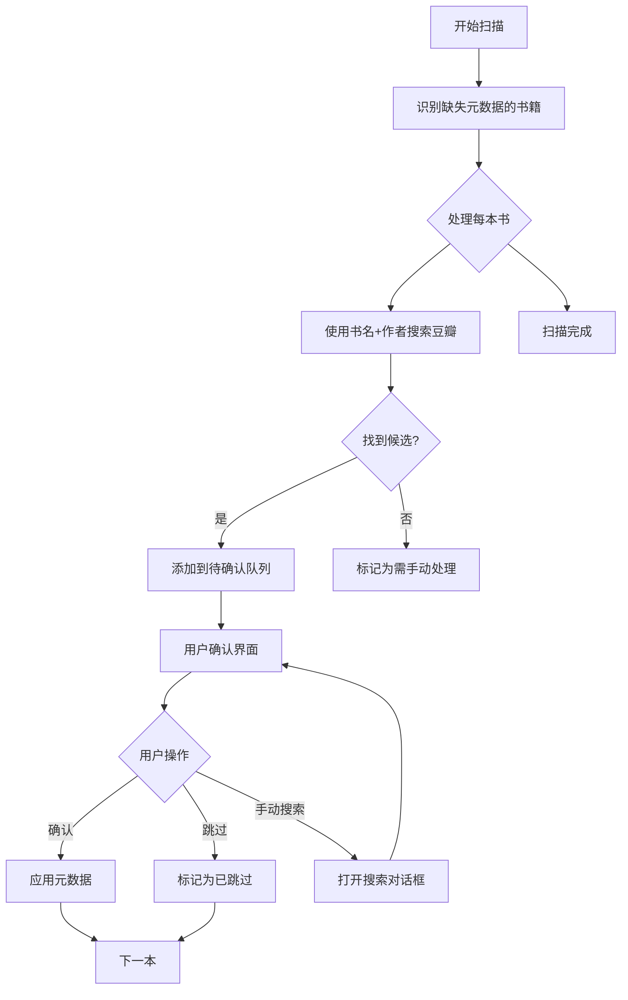

# 批量元数据增强功能设计方案

> **状态**：待实现  
> **创建日期**：2026-01-04  
> **最后更新**：2026-01-04

## 背景

用户有大批量书籍缺少关键元数据（书名冗余、出版社、出版日期、作者等），且没有 ISBN。需要一个两阶段流程：
1. **自动扫描与候选获取**：识别问题书籍，从书籍内容或豆瓣搜索获取候选元数据
2. **人工确认**：用户逐个或批量确认应用元数据

## 待确认事项

实现前需要确认：

1. **元数据提取策略**：
   - 简单模式：仅使用书名+作者搜索豆瓣
   - AI 辅助模式：从 EPUB 前几页提取完整元数据，再搜索

2. **合集类书籍处理**：是否需要"批量跳过"功能（根据标题关键词自动标记）？

3. **界面设计**：逐本确认（向导模式）还是列表批量确认（表格形式）？

---

## 核心流程设计



---

## 技术方案

### 后端 - 任务系统

#### 新增文件

**types.go** - 新增任务类型：
```go
TaskTypeMetadataEnrich TaskType = "metadata_enrich"
```

**metadata_enrich.go** - 元数据增强任务：
```go
type MetadataEnrichTask struct {
    id           string
    contentApi   *content.Api
    httpClient   *resty.Client
    doubanUrl    string
    status       TaskStatus
    mu           sync.RWMutex
    cancel       context.CancelFunc
    pendingQueue *PendingMetadataQueue
}

type PendingMetadataItem struct {
    BookID      int64              `json:"book_id"`
    CurrentBook content.Book       `json:"current_book"`
    Candidates  []DoubanCandidate  `json:"candidates"`
    Status      string             `json:"status"` // pending, confirmed, skipped, manual
    CreatedAt   time.Time          `json:"created_at"`
}

type DoubanCandidate struct {
    Title     string   `json:"title"`
    Authors   []string `json:"authors"`
    Publisher string   `json:"publisher"`
    PubDate   string   `json:"pubdate"`
    ISBN      string   `json:"isbn"`
    Image     string   `json:"image"`
    Rating    float64  `json:"rating"`
    Summary   string   `json:"summary"`
    Score     float64  `json:"match_score"` // 匹配度评分
}
```

**metadata_checker.go** - 元数据完整性检查器：
```go
type MetadataChecker struct {
    contentApi *content.Api
}

type MetadataIssue struct {
    BookID    int64    `json:"book_id"`
    Title     string   `json:"title"`
    Issues    []string `json:"issues"` // ["missing_author", "missing_publisher", "redundant_title"]
    Severity  string   `json:"severity"` // low, medium, high
}

func (c *MetadataChecker) ScanBooks(ctx context.Context) ([]MetadataIssue, error) {
    // 检查规则：
    // 1. 无作者 → high
    // 2. 无出版社 → medium  
    // 3. 无出版日期 → low
    // 4. 标题包含 "(xxx)" 或过长 → medium (可能是冗余)
    // 5. 无 ISBN → low
}
```

#### 修改文件

**task_handler.go** - 添加新 API：
- `GET /api/tasks/metadata-enrich/pending` - 获取待确认列表
- `POST /api/tasks/metadata-enrich/confirm/:bookId` - 确认应用元数据
- `POST /api/tasks/metadata-enrich/skip/:bookId` - 跳过书籍
- `POST /api/tasks/metadata-enrich/batch-confirm` - 批量确认

---

### 前端

#### 新增文件

**metadata-enrich/page.tsx** - 批量元数据增强页面：
- 任务启动按钮
- 待确认队列列表
- 确认/跳过/手动搜索操作
- 进度展示

**metadata-confirm-card.tsx** - 确认卡片组件：
- 左侧：当前书籍信息
- 右侧：候选元数据列表
- 底部：操作按钮

#### 修改文件

**metadata-service.ts** - 新增 API 方法：
```typescript
async getPendingEnrichments(): Promise<PendingMetadataItem[]>
async confirmEnrichment(bookId: number, candidate: DoubanCandidate): Promise<void>
async skipEnrichment(bookId: number): Promise<void>
async batchConfirmEnrichments(items: BatchConfirmRequest[]): Promise<void>
```

---

## 技术细节

### 匹配度评分算法

根据以下因素计算候选的匹配度：
- 书名相似度（Levenshtein 距离或 Jaccard 系数）
- 作者名匹配
- 豆瓣评分人数（越多越可靠）

### 性能考虑

- 豆瓣 API 有速率限制，任务中添加延迟（如 1 秒/请求）
- 待确认队列持久化到文件，防止重启丢失
- 支持断点续传（类似 `TocExtractTask` 的进度保存）

### 扩展性

后续可添加：
- AI 辅助从 EPUB 内容提取元数据
- 支持其他元数据源（Goodreads、Google Books）
- 批量自动确认（基于置信度阈值）

---

## 验证方案

### 自动测试

1. `metadata_enrich_test.go` - 元数据增强任务测试
2. `metadata_checker_test.go` - 元数据检查器测试

### 手动验证

1. 启动任务测试
2. 待确认队列测试
3. 确认/跳过操作测试
4. 前端 UI 测试

---

## 相关文件参考

- `internal/tasks/toc_extract.go` - 任务模式参考
- `internal/tasks/check_missing.go` - 扫描模式参考
- `web-next/src/components/metadata-search-dialog.tsx` - 搜索 UI 参考
- `web-next/src/lib/services/metadata-service.ts` - 元数据服务参考
