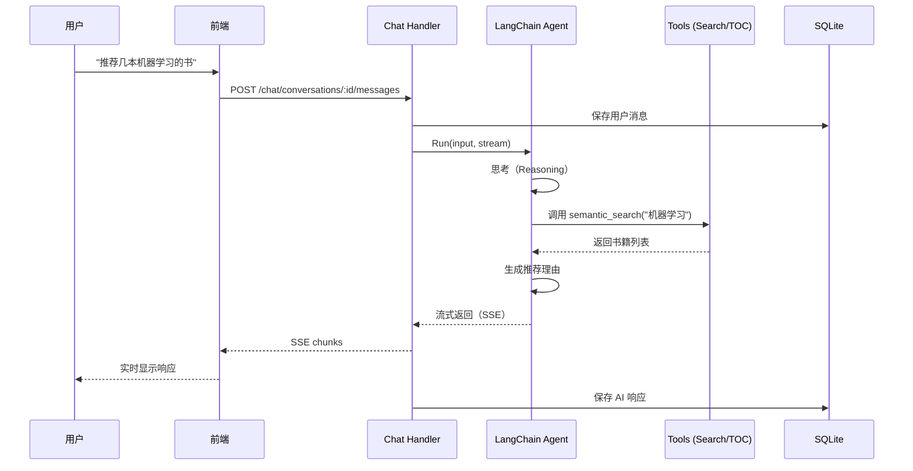

# Calibre API 大模型问答功能实施方案 v2

基于用户反馈重新设计的实施方案，集成 LangChainGo 框架，支持思考模式，实现对话持久化。

## 用户审核要点

> [!IMPORTANT]
> **重大技术决策**
> - **框架选择**: 使用 **LangChainGo** (github.com/tmc/langchaingo) 统一管理 LLM、Agent 和工具
> - **对话持久化**: 使用 **SQLite** 存储对话历史（轻量级，无需额外服务）
> - **思考模式**: 支持 DeepSeek-R1 等模型的推理链显示（`<thinking>` 标签）
> - **TOC 数据**: 直接使用现有的 `/api/read/:id/toc` 接口和 Qdrant 存储的 TOC 数据

> [!WARNING]
> **新增依赖和配置**
> - Go 依赖: `github.com/tmc/langchaingo` (最新版本)
> - 数据库: SQLite（存储在 `.cache/chat.db`）
> - 配置文件: 新增 `llm` 配置段（见下文）

> [!TIP]
> **渐进式实施**
> 本方案支持渐进式实施，可以先完成基础聊天功能，后续逐步扩展思考模式和高级 Agent 能力

## 提议的更改

### 后端架构

#### 数据库设计

##### [NEW] [migrations/001_create_chat_tables.sql](file:///Users/zhaojianyun/Developer/project/github/jianyun8023/calibre-api/internal/chat/migrations/001_create_chat_tables.sql)

创建对话和消息表：

```sql
-- 对话表
CREATE TABLE IF NOT EXISTS conversations (
    id TEXT PRIMARY KEY,
    title TEXT NOT NULL,
    created_at TIMESTAMP DEFAULT CURRENT_TIMESTAMP,
    updated_at TIMESTAMP DEFAULT CURRENT_TIMESTAMP
);

-- 消息表
CREATE TABLE IF NOT EXISTS messages (
    id TEXT PRIMARY KEY,
    conversation_id TEXT NOT NULL,
    role TEXT NOT NULL CHECK(role IN ('user', 'assistant', 'system')),
    content TEXT NOT NULL,
    thinking TEXT,  -- 存储思考过程（可选）
    metadata TEXT,  -- JSON 格式的元数据（如书籍引用）
    created_at TIMESTAMP DEFAULT CURRENT_TIMESTAMP,
    FOREIGN KEY (conversation_id) REFERENCES conversations(id) ON DELETE CASCADE
);

CREATE INDEX IF NOT EXISTS idx_messages_conversation ON messages(conversation_id);
CREATE INDEX IF NOT EXISTS idx_conversations_updated ON conversations(updated_at DESC);
```

---

#### LangChainGo 集成层

##### [NEW] [llm.go](file:///Users/zhaojianyun/Developer/project/github/jianyun8023/calibre-api/internal/chat/llm.go)

使用 LangChainGo 封装 LLM 客户端：

```go
package chat

import (
    "context"
    "github.com/tmc/langchaingo/llms"
    "github.com/tmc/langchaingo/llms/ollama"
    "github.com/tmc/langchaingo/llms/openai"
)

type LLMConfig struct {
    Provider string
    Ollama   OllamaConfig
    OpenAI   OpenAIConfig
}

type OllamaConfig struct {
    ServerURL string
    Model     string
}

type OpenAIConfig struct {
    APIKey string
    Model  string
    BaseURL string
}

// NewLLM creates a LangChainGo LLM client based on configuration
func NewLLM(cfg LLMConfig) (llms.Model, error) {
    switch cfg.Provider {
    case "ollama":
        return ollama.New(
            ollama.WithServerURL(cfg.Ollama.ServerURL),
            ollama.WithModel(cfg.Ollama.Model),
        )
    case "openai":
        return openai.New(
            openai.WithToken(cfg.OpenAI.APIKey),
            openai.WithModel(cfg.OpenAI.Model),
            openai.WithBaseURL(cfg.OpenAI.BaseURL),
        )
    default:
        return nil, fmt.Errorf("unsupported LLM provider: %s", cfg.Provider)
    }
}
```

##### [NEW] [agent.go](file:///Users/zhaojianyun/Developer/project/github/jianyun8023/calibre-api/internal/chat/agent.go)

定义 Agent 和工具：

```go
package chat

import (
    "context"
    "github.com/tmc/langchaingo/agents"
    "github.com/tmc/langchaingo/chains"
    "github.com/tmc/langchaingo/llms"
    "github.com/tmc/langchaingo/memory"
    "github.com/tmc/langchaingo/tools"
)

type CalibreAgent struct {
    llm      llms.Model
    memory   memory.ConversationBuffer
    tools    []tools.Tool
    executor *agents.Executor
}

// NewCalibreAgent 创建智能书库 Agent
func NewCalibreAgent(llm llms.Model, searcher *qdrant.Searcher, contentAPI *content.Api) (*CalibreAgent, error) {
    // 定义工具
    tools := []tools.Tool{
        NewSemanticSearchTool(searcher),
        NewBookTocTool(contentAPI),
        NewRecommendationTool(searcher),
    }
    
    // 创建 Agent
    executor, err := agents.Initialize(
        llm,
        tools,
        agents.ZeroShotReactDescription,
        agents.WithMemory(memory.NewConversationBuffer()),
    )
    
    if err != nil {
        return nil, err
    }
    
    return &CalibreAgent{
        llm:      llm,
        tools:    tools,
        executor: executor,
    }, nil
}

// Run 执行 Agent（支持流式输出）
func (a *CalibreAgent) Run(ctx context.Context, input string, stream func(chunk string) error) (string, error) {
    // 使用 LangChainGo 的流式回调
    return a.executor.Call(ctx, agents.ChainValues{
        "input": input,
    }, chains.WithStreamingFunc(func(ctx context.Context, chunk []byte) error {
        return stream(string(chunk))
    }))
}
```

##### [NEW] [tools.go](file:///Users/zhaojianyun/Developer/project/github/jianyun8023/calibre-api/internal/chat/tools.go)

实现工具（Tools）：

```go
package chat

import (
    "context"
    "encoding/json"
    "github.com/tmc/langchaingo/tools"
)

// SemanticSearchTool - 语义搜索工具
type SemanticSearchTool struct {
    searcher *qdrant.Searcher
}

func NewSemanticSearchTool(searcher *qdrant.Searcher) *SemanticSearchTool {
    return &SemanticSearchTool{searcher: searcher}
}

func (t *SemanticSearchTool) Name() string {
    return "semantic_search"
}

func (t *SemanticSearchTool) Description() string {
    return "搜索书库中的书籍。输入：自然语言查询（如'机器学习相关的书'）。输出：相关书籍列表。"
}

func (t *SemanticSearchTool) Call(ctx context.Context, input string) (string, error) {
    results, err := t.searcher.Search(ctx, input, 5)
    if err != nil {
        return "", err
    }
    
    // 格式化结果
    books := make([]map[string]interface{}, 0)
    for _, result := range results {
        books = append(books, map[string]interface{}{
            "id":      result.Book.ID,
            "title":   result.Book.Title,
            "authors": result.Book.Authors,
            "score":   result.Score,
        })
    }
    
    output, _ := json.Marshal(books)
    return string(output), nil
}

// BookTocTool - 获取书籍目录工具
type BookTocTool struct {
    contentAPI *content.Api
}

func NewBookTocTool(contentAPI *content.Api) *BookTocTool {
    return &BookTocTool{contentAPI: contentAPI}
}

func (t *BookTocTool) Name() string {
    return "get_book_toc"
}

func (t *BookTocTool) Description() string {
    return "获取指定书籍的目录（TOC）。输入：书籍ID（整数）。输出：书籍的章节结构。"
}

func (t *BookTocTool) Call(ctx context.Context, input string) (string, error) {
    // 直接使用现有的接口获取 TOC
    // 注意：这里需要适配 contentAPI 或直接调用 HTTP API
    // 简化实现：返回提示信息
    return fmt.Sprintf("请使用 GET /api/read/%s/toc 接口获取目录", input), nil
}

// RecommendationTool - 书籍推荐工具
type RecommendationTool struct {
    searcher *qdrant.Searcher
}

func NewRecommendationTool(searcher *qdrant.Searcher) *RecommendationTool {
    return &RecommendationTool{searcher: searcher}
}

func (t *RecommendationTool) Name() string {
    return "recommend_books"
}

func (t *RecommendationTool) Description() string {
    return "根据用户兴趣推荐书籍。输入：用户兴趣描述。输出：推荐书籍列表及理由。"
}

func (t *RecommendationTool) Call(ctx context.Context, input string) (string, error) {
    // 使用语义搜索
    results, err := t.searcher.Search(ctx, input, 3)
    if err != nil {
        return "", err
    }
    
    books := make([]map[string]interface{}, 0)
    for _, result := range results {
        books = append(books, map[string]interface{}{
            "id":      result.Book.ID,
            "title":   result.Book.Title,
            "authors": result.Book.Authors,
            "reason":  fmt.Sprintf("匹配度 %.2f", result.Score),
        })
    }
    
    output, _ := json.Marshal(books)
    return string(output), nil
}
```

---

#### 思考模式支持

##### [NEW] [thinking.go](file:///Users/zhaojianyun/Developer/project/github/jianyun8023/calibre-api/internal/chat/thinking.go)

解析和处理思考模式：

```go
package chat

import (
    "regexp"
    "strings"
)

// ThinkingResponse 包含思考过程和最终答案
type ThinkingResponse struct {
    Thinking string `json:"thinking,omitempty"` // 思考过程
    Answer   string `json:"answer"`             // 最终答案
}

var (
    thinkingRegex = regexp.MustCompile(`<thinking>(.*?)</thinking>`)
    answerRegex   = regexp.MustCompile(`<answer>(.*?)</answer>`)
)

// ParseThinkingResponse 解析包含思考标签的响应
func ParseThinkingResponse(content string) ThinkingResponse {
    var response ThinkingResponse
    
    // 提取思考过程
    if matches := thinkingRegex.FindStringSubmatch(content); len(matches) > 1 {
        response.Thinking = strings.TrimSpace(matches[1])
    }
    
    // 提取答案
    if matches := answerRegex.FindStringSubmatch(content); len(matches) > 1 {
        response.Answer = strings.TrimSpace(matches[1])
    } else {
        // 如果没有答案标签，使用整个内容（去除思考部分）
        response.Answer = strings.TrimSpace(thinkingRegex.ReplaceAllString(content, ""))
    }
    
    return response
}

// EnableThinkingMode 配置 LLM 启用思考模式
func EnableThinkingMode() llms.CallOption {
    return func(o *llms.CallOptions) {
        // 添加系统提示，指示模型使用思考标签
        o.SystemPrompt = `在回答问题时，请先在 <thinking> 标签中展示你的推理过程，
然后在 <answer> 标签中给出最终答案。

示例：
<thinking>
首先，我需要理解用户的需求...
根据这些信息，我可以推断...
</thinking>

<answer>
基于以上分析，我推荐以下书籍...
</answer>`
    }
}
```

---

#### 数据库层

##### [NEW] [db.go](file:///Users/zhaojianyun/Developer/project/github/jianyun8023/calibre-api/internal/chat/db.go)

对话和消息的数据库操作：

```go
package chat

import (
    "database/sql"
    "time"
    _ "github.com/mattn/go-sqlite3"
)

type DB struct {
    conn *sql.DB
}

type Conversation struct {
    ID        string    `json:"id"`
    Title     string    `json:"title"`
    CreatedAt time.Time `json:"created_at"`
    UpdatedAt time.Time `json:"updated_at"`
}

type Message struct {
    ID             string    `json:"id"`
    ConversationID string    `json:"conversation_id"`
    Role           string    `json:"role"` // user, assistant, system
    Content        string    `json:"content"`
    Thinking       string    `json:"thinking,omitempty"`
    Metadata       string    `json:"metadata,omitempty"` // JSON
    CreatedAt      time.Time `json:"created_at"`
}

func NewDB(dbPath string) (*DB, error) {
    conn, err := sql.Open("sqlite3", dbPath)
    if err != nil {
        return nil, err
    }
    
    // 运行迁移
    if err := runMigrations(conn); err != nil {
        return nil, err
    }
    
    return &DB{conn: conn}, nil
}

// CreateConversation 创建新对话
func (db *DB) CreateConversation(title string) (*Conversation, error) {
    id := uuid.New().String()
    now := time.Now()
    
    _, err := db.conn.Exec(
        "INSERT INTO conversations (id, title, created_at, updated_at) VALUES (?, ?, ?, ?)",
        id, title, now, now,
    )
    if err != nil {
        return nil, err
    }
    
    return &Conversation{ID: id, Title: title, CreatedAt: now, UpdatedAt: now}, nil
}

// SaveMessage 保存消息
func (db *DB) SaveMessage(msg *Message) error {
    if msg.ID == "" {
        msg.ID = uuid.New().String()
    }
    msg.CreatedAt = time.Now()
    
    _, err := db.conn.Exec(
        `INSERT INTO messages (id, conversation_id, role, content, thinking, metadata, created_at) 
         VALUES (?, ?, ?, ?, ?, ?, ?)`,
        msg.ID, msg.ConversationID, msg.Role, msg.Content, msg.Thinking, msg.Metadata, msg.CreatedAt,
    )
    
    // 更新对话时间
    if err == nil {
        db.conn.Exec("UPDATE conversations SET updated_at = ? WHERE id = ?", time.Now(), msg.ConversationID)
    }
    
    return err
}

// GetConversationMessages 获取对话的所有消息
func (db *DB) GetConversationMessages(conversationID string) ([]*Message, error) {
    rows, err := db.conn.Query(
        "SELECT id, conversation_id, role, content, thinking, metadata, created_at FROM messages WHERE conversation_id = ? ORDER BY created_at ASC",
        conversationID,
    )
    if err != nil {
        return nil, err
    }
    defer rows.Close()
    
    var messages []*Message
    for rows.Next() {
        var msg Message
        err := rows.Scan(&msg.ID, &msg.ConversationID, &msg.Role, &msg.Content, &msg.Thinking, &msg.Metadata, &msg.CreatedAt)
        if err != nil {
            return nil, err
        }
        messages = append(messages, &msg)
    }
    
    return messages, nil
}

// ListConversations 列出所有对话
func (db *DB) ListConversations(limit int) ([]*Conversation, error) {
    rows, err := db.conn.Query(
        "SELECT id, title, created_at, updated_at FROM conversations ORDER BY updated_at DESC LIMIT ?",
        limit,
    )
    if err != nil {
        return nil, err
    }
    defer rows.Close()
    
    var conversations []*Conversation
    for rows.Next() {
        var conv Conversation
        err := rows.Scan(&conv.ID, &conv.Title, &conv.CreatedAt, &conv.UpdatedAt)
        if err != nil {
            return nil, err
        }
        conversations = append(conversations, &conv)
    }
    
    return conversations, nil
}
```

---

#### API 层

##### [NEW] [chat_handler.go](file:///Users/zhaojianyun/Developer/project/github/jianyun8023/calibre-api/internal/calibre/chat_handler.go)

聊天 API 处理函数：

```go
package calibre

import (
    "fmt"
    "net/http"
    "github.com/gin-gonic/gin"
    "github.com/jianyun8023/calibre-api/internal/chat"
)

// CreateConversation 创建新对话
func (c *Api) CreateConversation(r *gin.Context) {
    var req struct {
        Title string `json:"title"`
    }
    
    if err := r.BindJSON(&req); err != nil {
        r.JSON(http.StatusBadRequest, gin.H{"error": err.Error()})
        return
    }
    
    conv, err := c.chatDB.CreateConversation(req.Title)
    if err != nil {
        r.JSON(http.StatusInternalServerError, gin.H{"error": err.Error()})
        return
    }
    
    r.JSON(http.StatusOK, conv)
}

// ListConversations 列出对话历史
func (c *Api) ListConversations(r *gin.Context) {
    conversations, err := c.chatDB.ListConversations(50)
    if err != nil {
        r.JSON(http.StatusInternalServerError, gin.H{"error": err.Error()})
        return
    }
    
    r.JSON(http.StatusOK, conversations)
}

// GetConversationMessages 获取对话消息
func (c *Api) GetConversationMessages(r *gin.Context) {
    conversationID := r.Param("id")
    
    messages, err := c.chatDB.GetConversationMessages(conversationID)
    if err != nil {
        r.JSON(http.StatusInternalServerError, gin.H{"error": err.Error()})
        return
    }
    
    r.JSON(http.StatusOK, messages)
}

// SendMessage 发送消息（流式响应）
func (c *Api) SendMessage(r *gin.Context) {
    conversationID := r.Param("id")
    
    var req struct {
        Content string `json:"content"`
    }
    
    if err := r.BindJSON(&req); err != nil {
        r.JSON(http.StatusBadRequest, gin.H{"error": err.Error()})
        return
    }
    
    // 保存用户消息
    userMsg := &chat.Message{
        ConversationID: conversationID,
        Role:           "user",
        Content:        req.Content,
    }
    if err := c.chatDB.SaveMessage(userMsg); err != nil {
        r.JSON(http.StatusInternalServerError, gin.H{"error": err.Error()})
        return
    }
    
    // 设置 SSE 响应头
    r.Header("Content-Type", "text/event-stream")
    r.Header("Cache-Control", "no-cache")
    r.Header("Connection", "keep-alive")
    
    // 获取对话历史（用于上下文）
    messages, _ := c.chatDB.GetConversationMessages(conversationID)
    
    // 构建上下文
    context := buildContext(messages)
    
    // 流式调用 Agent
    var fullResponse string
    err := c.agent.Run(r.Request.Context(), req.Content, func(chunk string) error {
        fullResponse += chunk
        // 发送 SSE 事件
        fmt.Fprintf(r.Writer, "data: %s\n\n", chunk)
        r.Writer.Flush()
        return nil
    })
    
    if err != nil {
        fmt.Fprintf(r.Writer, "data: {\"error\": \"%s\"}\n\n", err.Error())
        r.Writer.Flush()
        return
    }
    
    // 解析思考和答案
    parsed := chat.ParseThinkingResponse(fullResponse)
    
    // 保存 AI 响应
    assistantMsg := &chat.Message{
        ConversationID: conversationID,
        Role:           "assistant",
        Content:        parsed.Answer,
        Thinking:       parsed.Thinking,
    }
    c.chatDB.SaveMessage(assistantMsg)
    
    // 发送完成信号
    fmt.Fprintf(r.Writer, "data: [DONE]\n\n")
    r.Writer.Flush()
}

func buildContext(messages []*chat.Message) string {
    // 构建对话上下文
    var context string
    for _, msg := range messages {
        context += fmt.Sprintf("%s: %s\n", msg.Role, msg.Content)
    }
    return context
}
```

##### [MODIFY] [route.go](file:///Users/zhaojianyun/Developer/project/github/jianyun8023/calibre-api/internal/calibre/route.go)

添加聊天路由：

```go
// Chat routes
api.POST("/chat/conversations", h.CreateConversation)
api.GET("/chat/conversations", h.ListConversations)
api.GET("/chat/conversations/:id/messages", h.GetConversationMessages)
api.POST("/chat/conversations/:id/messages", h.SendMessage)
```

---

#### 配置更新

##### [MODIFY] [config.yaml](file:///Users/zhaojianyun/Developer/project/github/jianyun8023/calibre-api/config.yaml)

添加 LLM 配置：

```yaml
# LLM 配置（用于智能问答）
llm:
  provider: "ollama"  # 或 "openai"
  ollama:
    server_url: "http://localhost:11434"
    model: "deepseek-r1:7b"  # 支持思考模式的模型
  openai:
    api_key: ""  # 建议使用环境变量 OPENAI_API_KEY
    model: "gpt-4"
    base_url: "https://api.openai.com/v1"

# 聊天数据库
chat:
  db_path: ".cache/chat.db"
```

---

### 前端架构

#### 技术选型

**核心组件库**：
- **@aivue/chatbot** - AI 聊天专用组件（支持流式响应、Markdown）
- **vue-markdown-x** - 流式 Markdown 渲染
- **@vueuse/core** - SSE 工具（已有依赖）
- **Element Plus** - 基础 UI 组件（已有）

**依赖安装**：
```bash
npm install @aivue/chatbot vue-markdown-x
```

---

#### 聊天视图

##### [NEW] [Chat.vue](file:///Users/zhaojianyun/Developer/project/github/jianyun8023/calibre-api/app/calibre-pages/src/views/Chat.vue)

使用 `@aivue/chatbot` 快速搭建聊天界面：

```vue
<template>
  <div class="chat-container">
    <!-- 对话列表侧边栏 -->
    <el-aside width="250px" class="conversation-sidebar">
      <el-button @click="createConversation" type="primary" class="new-chat-btn">
        <el-icon><ChatDotRound /></el-icon>
        新建对话
      </el-button>
      
      <el-scrollbar class="conversation-list">
        <div 
          v-for="conv in conversations" 
          :key="conv.id"
          :class="['conversation-item', { active: currentConversation?.id === conv.id }]"
          @click="selectConversation(conv)"
        >
          {{ conv.title }}
        </div>
      </el-scrollbar>
    </el-aside>
    
    <!-- 消息区域：使用 @aivue/chatbot -->
    <el-main class="chat-main">
      <ChatBot
        v-if="currentConversation"
        :messages="formattedMessages"
        :streaming="sending"
        :markdown="true"
        @send="handleSendMessage"
      >
        <!-- 自定义消息渲染（支持思考过程） -->
        <template #message="{ message }">
          <div class="message-wrapper">
            <!-- 思考过程折叠 -->
            <el-collapse v-if="message.thinking" class="thinking-collapse">
              <el-collapse-item title="💭 思考过程" name="1">
                <VueMarkdown :md="message.thinking" />
              </el-collapse-item>
            </el-collapse>
            
            <!-- 消息内容 -->
            <VueMarkdown :md="message.content" class="message-content" />
            
            <!-- 书籍推荐卡片 -->
            <div v-if="message.books?.length" class="book-recommendations">
              <BookCard v-for="book in message.books" :key="book.id" :book="book" />
            </div>
          </div>
        </template>
      </ChatBot>
    </el-main>
  </div>
</template>

<script setup lang="ts">
import { ref, computed, onMounted } from 'vue'
import { useEventSource } from '@vueuse/core'
import { ChatDotRound } from '@element-plus/icons-vue'
import { ChatBot } from '@aivue/chatbot'
import { VueMarkdown } from 'vue-markdown-x'
import '@aivue/chatbot/style.css'
import BookCard from '@/components/BookCard.vue'
import { createConversation, listConversations, getMessages } from '@/api/chat'

const conversations = ref([])
const currentConversation = ref(null)
const messages = ref([])
const sending = ref(false)

// 格式化消息供 ChatBot 使用
const formattedMessages = computed(() => {
  return messages.value.map(msg => ({
    ...msg,
    sender: msg.role === 'user' ? 'user' : 'bot'
  }))
})

onMounted(async () => {
  conversations.value = await listConversations()
  if (conversations.value.length > 0) {
    selectConversation(conversations.value[0])
  }
})

const createConversation = async () => {
  const conv = await createConversation({ title: '新对话' })
  conversations.value.unshift(conv)
  selectConversation(conv)
}

const selectConversation = async (conv) => {
  currentConversation.value = conv
  messages.value = await getMessages(conv.id)
}

const handleSendMessage = async (content: string) => {
  if (!content.trim() || sending.value) return
  
  // 添加用户消息
  messages.value.push({
    role: 'user',
    content,
    sender: 'user'
  })
  
  sending.value = true
  
  // AI 消息（流式更新）
  const aiMessage = {
    role: 'assistant',
    content: '',
    thinking: '',
    sender: 'bot'
  }
  messages.value.push(aiMessage)
  
  try {
    // 使用 SSE 接收流式响应
    const response = await fetch(`/api/chat/conversations/${currentConversation.value.id}/messages`, {
      method: 'POST',
      headers: { 'Content-Type': 'application/json' },
      body: JSON.stringify({ content })
    })
    
    const reader = response.body!.getReader()
    const decoder = new TextDecoder()
    
    while (true) {
      const { done, value } = await reader.read()
      if (done) break
      
      const chunk = decoder.decode(value)
      const lines = chunk.split('\n')
      
      for (const line of lines) {
        if (line.startsWith('data: ')) {
          const data = line.substring(6)
          if (data === '[DONE]') break
          
          // 解析数据（可能包含 thinking 标签）
          const parsed = parseStreamChunk(data)
          if (parsed.thinking) {
            aiMessage.thinking += parsed.thinking
          } else {
            aiMessage.content += data
          }
        }
      }
    }
  } finally {
    sending.value = false
  }
}

const parseStreamChunk = (data: string) => {
  // 简单的思考标签检测
  if (data.includes('<thinking>')) {
    return { thinking: data.replace(/<\/?thinking>/g, '') }
  }
  return { content: data }
}
</script>

<style scoped>
.chat-container {
  display: flex;
  height: 100%;
}

.conversation-sidebar {
  background: var(--glass-bg);
  border-right: 1px solid var(--el-border-color);
}

.thinking-collapse {
  margin-bottom: 12px;
  background: var(--glass-bg-medium);
  border-radius: 8px;
}

.book-recommendations {
  display: flex;
  gap: 12px;
  margin-top: 12px;
  flex-wrap: wrap;
}
</style>
```

##### [NEW] [BookCard.vue](file:///Users/zhaojianyun/Developer/project/github/jianyun8023/calibre-api/app/calibre-pages/src/components/BookCard.vue)

书籍推荐卡片组件（在聊天中展示书籍）：

```vue
<template>
  <el-card class="book-card" shadow="hover" @click="goToBook">
    
    <div class="book-info">
      <h4>{{ book.title }}</h4>
      <p class="authors">{{ book.authors?.join(', ') }}</p>
      <el-tag v-if="book.reason" size="small" type="info">
        {{ book.reason }}
      </el-tag>
    </div>
  </el-card>
</template>

<script setup lang="ts">
import { useRouter } from 'vue-router'

const props = defineProps<{
  book: {
    id: number
    title: string
    authors?: string[]
    reason?: string
  }
}>()

const router = useRouter()

const goToBook = () => {
  router.push(`/detail/${props.book.id}`)
}
</script>

<style scoped>
.book-card {
  width: 200px;
  cursor: pointer;
  transition: transform 0.2s;
}

.book-card:hover {
  transform: translateY(-4px);
}

.book-cover {
  width: 100%;
  height: 260px;
  object-fit: cover;
  border-radius: 4px;
}

.book-info {
  margin-top: 8px;
}

.book-info h4 {
  font-size: 14px;
  margin: 0 0 4px 0;
  overflow: hidden;
  text-overflow: ellipsis;
  white-space: nowrap;
}

.authors {
  font-size: 12px;
  color: var(--el-text-color-secondary);
  margin: 0 0 8px 0;
}
</style>
```

##### [NEW] [chat.ts](file:///Users/zhaojianyun/Developer/project/github/jianyun8023/calibre-api/app/calibre-pages/src/api/chat.ts)

聊天 API 客户端（简化版）：

```typescript
export async function createConversation(data: { title: string }) {
  const response = await fetch('/api/chat/conversations', {
    method: 'POST',
    headers: { 'Content-Type': 'application/json' },
    body: JSON.stringify(data)
  })
  return response.json()
}

export async function listConversations() {
  const response = await fetch('/api/chat/conversations')
  return response.json()
}

export async function getMessages(conversationId: string) {
  const response = await fetch(`/api/chat/conversations/${conversationId}/messages`)
  return response.json()
}

// SSE 流式响应由组件内部处理（见 Chat.vue）
```

---

#### 样式定制

##### [MODIFY] [index.scss](file:///Users/zhaojianyun/Developer/project/github/jianyun8023/calibre-api/app/calibre-pages/src/styles/index.scss)

添加聊天组件样式覆盖，统一 Element Plus 风格：

```scss
// ChatBot 组件样式覆盖
.chatbot-container {
  --chat-bg-color: var(--el-bg-color);
  --chat-message-user-bg: var(--el-color-primary);
  --chat-message-bot-bg: var(--glass-bg);
  --chat-input-bg: var(--glass-bg);
  --chat-border-color: var(--el-border-color);
  --chat-text-color: var(--el-text-color-primary);
  
  font-family: var(--el-font-family);
  height: 100%;
}

// 思考过程样式
.thinking-collapse {
  .el-collapse-item__header {
    background: transparent;
    padding: 8px 12px;
    font-size: 13px;
    color: var(--el-text-color-secondary);
  }
  
  .el-collapse-item__content {
    padding: 12px;
    background: var(--glass-bg-strong);
    border-radius: 4px;
    font-family: 'Monaco', 'Menlo', monospace;
    font-size: 12px;
    line-height: 1.6;
  }
}
```

---

## 数据流设计



---

## 依赖管理

### Go 依赖

```bash
go get github.com/tmc/langchaingo@latest
go get github.com/mattn/go-sqlite3
```

更新 `go.mod`:
```go
require (
    github.com/tmc/langchaingo v0.1.12
    github.com/mattn/go-sqlite3 v1.14.18
)
```

### 前端依赖

**推荐方案（最小化依赖）**：
```bash
cd app/calibre-pages
npm install @aivue/chatbot vue-markdown-x
```

**可选（如需完全自定义）**：
```bash
npm install markdown-it highlight.js
npm install @types/markdown-it --save-dev
```

更新后的 `package.json`:
```json
{
  "dependencies": {
    "@aivue/chatbot": "^1.0.0",
    "@element-plus/icons-vue": "^2.3.1",
    "@vueuse/core": "^10.11.1",
    "element-plus": "^2.7.8",
    "vue": "^3.4.29",
    "vue-markdown-x": "^1.0.0",
    "vue-reader": "^1.2.15",
    "vue-router": "^4.3.3"
  }
}
```

---

## 验证计划

### 自动化测试

#### 后端单元测试

```bash
# 测试数据库操作
go test ./internal/chat -v -run TestDB

# 测试 Agent 工具
go test ./internal/chat -v -run TestTools

# 测试思考模式解析
go test ./internal/chat -v -run TestThinking
```

#### 集成测试

```bash
# 创建对话
curl -X POST http://localhost:8080/api/chat/conversations \
  -H "Content-Type: application/json" \
  -d '{"title": "测试对话"}'

# 发送消息（流式）
curl -X POST http://localhost:8080/api/chat/conversations/{id}/messages \
  -H "Content-Type: application/json" \
  -d '{"content": "推荐几本编程书"}' \
  --no-buffer
```

---

### 手动验证

#### 1. 配置 LLM

启动 Ollama 并拉取模型：
```bash
ollama pull deepseek-r1:7b
```

更新 `config.yaml`。

#### 2. 启动服务

```bash
./calibre-api
```

检查日志确认：
- SQLite 数据库已创建
- LangChainGo Agent 已初始化
- 工具已注册

#### 3. 前端测试

```bash
cd app/calibre-pages
npm run dev
```

测试场景：
- 创建新对话
- 发送消息并观察流式响应
- 查看思考过程（如果使用支持的模型）
- 测试书籍推荐和搜索

---

## 部署清单

- [ ] 配置 LLM 提供商（Ollama 或 OpenAI）
- [ ] 设置 SQLite 数据库路径（默认 `.cache/chat.db`）
- [ ] 配置环境变量（如 `OPENAI_API_KEY`）
- [ ] 运行数据库迁移
- [ ] 测试 Agent 工具连接（Qdrant、Content API）
- [ ] 前端构建并部署

---

## 扩展方向

1. **高级 Agent 能力**
   - 多轮对话上下文管理
   - 工具链组合（先搜索，再总结）
   
2. **思考模式优化**
   - 支持更多模型（Claude、Gemini）
   - 可视化推理路径

3. **用户体验**
   - 语音输入/输出
   - 书籍评分集成
   - 对话导出功能

4. **性能优化**
   - 响应缓存
   - 并发请求限制
   - Token 使用统计
