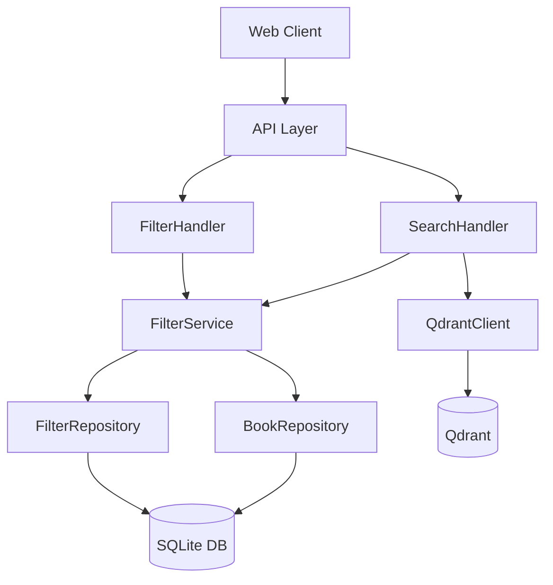
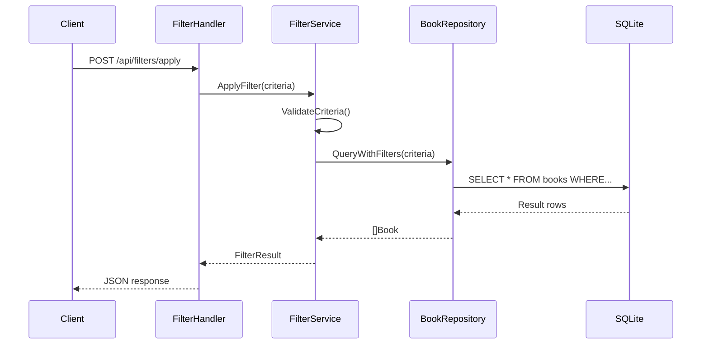

# 🏗️ Advanced Book Filtering - Design Specification

> **Status**: Approved ✅  
> **Owner**: AI Copilot  
> **Complexity**: High  
> **Design Type**: Multi-Module

<!-- English: This document defines the architecture and technical design.
     Includes ADRs, data models, API contracts, and file manifest.
     
     中文：本文档定义架构和技术设计。
     包括 ADR、数据模型、API 合约和文件清单。
-->

## 0. 📋 Context & Requirements Reference

> **PREWORK**: `prework.md`  
> **REQUIREMENTS**: `requirements.md`

### 0.1 User Story Coverage (Traceability Matrix)

| User Story | Design Section | Component/API | Status |
|----------|--------|----------|------|
| US-001 | Section 4.1, 5.1 | `FilterService.Apply()` | ✅ Covered |
| US-002 | Section 4.2, 5.2 | `FilterService.Save()` | ✅ Covered |
| US-003 | Section 4.3 | `FilterService.Update()` | ✅ Covered |
| US-004 | Section 4.3 | `FilterService.Update()` | ✅ Covered |
| US-005 | Section 4.4 | `FilterService.Delete()` | ✅ Covered |
| US-006 | N/A | Deferred to v2 | ⏸️ Out of Scope |
| US-007 | Section 5.3 | `FilterService.Preview()` | ✅ Covered |

### 0.2 Key Constraints from PREWORK

- Must use existing Calibre SQLite database (add custom tables only)
- Must reuse `SearchHandler` infrastructure
- Must follow RESTful API patterns
- Performance target: P95 < 300ms

## 1. 🧠 Design Rationale (ADR - Architecture Decision Records)

### ADR-001: Use JSON Column for Filter Criteria

- **Status**: Accepted ✅
- **Context**: Need to store flexible filter criteria (different fields, operators, values)
- **Decision**: Store criteria as JSON column in SQLite instead of separate tables
- **Alternatives Considered**:
  - **Option A**: Separate `filter_criteria` table with foreign key - Rejected (over-engineering, complex joins)
  - **Option B**: Serialized string - Rejected (hard to query, no validation)
- **Consequences**: 
  - ✅ Easier: Flexible schema, simple queries
  - ❌ Harder: Cannot index individual criteria fields

### ADR-002: Extend SearchHandler Instead of New Service

- **Status**: Accepted ✅
- **Context**: Need to apply filters to book search
- **Decision**: Add filter support to existing `SearchHandler`
- **Alternatives Considered**:
  - **Option A**: Create separate `FilterService` - Rejected (code duplication)
  - **Option B**: Microservice - Rejected (massive over-engineering)
- **Consequences**:
  - ✅ Easier: Reuse existing search logic, single endpoint
  - ❌ Harder: SearchHandler becomes larger (mitigated by good organization)

## 2. 🧩 Architecture & Boundaries

### 2.1 Component Diagram



### 2.2 Dependencies

- **Upstream**: Web Client calls API
- **Downstream**: 
  - FilterService → FilterRepository (data access)
  - FilterService → BookRepository (book queries)
  - SearchHandler → QdrantClient (semantic search)

## 3. 💾 Data Model (Foundation)

### Database Schema

```sql
-- New table for saved filters
CREATE TABLE IF NOT EXISTS calibre_saved_filters (
    id INTEGER PRIMARY KEY AUTOINCREMENT,
    name TEXT NOT NULL,
    description TEXT,
    criteria JSON NOT NULL,  -- ADR-001: JSON column
    created_at TIMESTAMP DEFAULT CURRENT_TIMESTAMP,
    updated_at TIMESTAMP DEFAULT CURRENT_TIMESTAMP,
    user_id TEXT,  -- Future: for multi-user support
    is_public BOOLEAN DEFAULT 0,
    usage_count INTEGER DEFAULT 0
);

-- Indexes for performance
CREATE INDEX idx_filters_name ON calibre_saved_filters(name);
CREATE INDEX idx_filters_user ON calibre_saved_filters(user_id);
CREATE INDEX idx_filters_created ON calibre_saved_filters(created_at DESC);
```

### Go Types

```go
// internal/calibre/types.go

type SavedFilter struct {
    ID          int64          `json:"id"`
    Name        string         `json:"name"`
    Description string         `json:"description,omitempty"`
    Criteria    FilterCriteria `json:"criteria"`
    CreatedAt   time.Time      `json:"created_at"`
    UpdatedAt   time.Time      `json:"updated_at"`
    UserID      string         `json:"user_id,omitempty"`
    IsPublic    bool           `json:"is_public"`
    UsageCount  int            `json:"usage_count"`
}

type FilterCriteria struct {
    Conditions []FilterCondition `json:"conditions"`
    Logic      string            `json:"logic"` // "AND" or "OR"
}

type FilterCondition struct {
    Field    string      `json:"field"`    // e.g., "genre", "rating"
    Operator string      `json:"operator"` // e.g., "=", ">", "contains"
    Value    interface{} `json:"value"`
}
```

## 4. 🔌 Interface Specification (Contracts)

### 4.1 API: Apply Filter

```http
POST /api/filters/apply
Content-Type: application/json

{
  "criteria": {
    "conditions": [
      {"field": "genre", "operator": "=", "value": "Science Fiction"},
      {"field": "rating", "operator": ">=", "value": 4}
    ],
    "logic": "AND"
  },
  "limit": 20,
  "offset": 0
}

Response 200 OK:
{
  "books": [...],
  "total": 42,
  "limit": 20,
  "offset": 0
}
```

### 4.2 API: Save Filter

```http
POST /api/filters
Content-Type: application/json

{
  "name": "Best Sci-Fi Books",
  "description": "Highly rated science fiction",
  "criteria": {...}
}

Response 201 Created:
{
  "id": 123,
  "name": "Best Sci-Fi Books",
  ...
}
```

### 4.3 API: Update Filter

```http
PUT /api/filters/:id
Content-Type: application/json

{
  "name": "Updated Name",
  "criteria": {...}
}

Response 200 OK:
{
  "id": 123,
  "name": "Updated Name",
  ...
}
```

### 4.4 API: Delete Filter

```http
DELETE /api/filters/:id

Response 204 No Content
```

## 5. ⚙️ Core Logic & Flows (Engine)

### 5.1 Filter Application Flow



## 6. 🛡️ Security & Non-Functional Requirements

### Edge Cases
- Empty filter criteria → Return all books (same as no filter)
- Invalid field name → Return 400 Bad Request with error message
- SQL injection attempt → Sanitized by parameterized queries

### Security
- **Input Validation**: Whitelist allowed fields and operators
- **SQL Injection**: Use parameterized queries only
- **Rate Limiting**: 60 requests/minute per IP

### Performance
- **Caching**: Cache filter results for 5 minutes
- **Indexes**: Database indexes on filter fields
- **Pagination**: Always paginate results (max 100 per page)

## 7. ✅ Verification Strategy

### 7.1 Unit Tests

| Test Suite | Target | Key Scenarios |
|---------|------|----------|
| `filter_service_test.go` | `FilterService` | CRUD operations, validation |
| `filter_repository_test.go` | `FilterRepository` | Database operations |

### 7.2 Integration Tests

| Test Suite | Target | Key Scenarios |
|---------|------|----------|
| `filter_handler_test.go` | `/api/filters/*` | API endpoints, error handling |

## 8. Rollback Strategy

- **Feature Flag**: `features.advanced_filters` (default: false)
- **DB Rollback**: Migration down script to drop `calibre_saved_filters` table
- **API Compatibility**: New endpoints don't affect existing `/api/search`

## 9. 📁 File Manifest (Implementation Guide for PLAN) 🔴 Critical

### 9.1 Files to Create

| File Path | Type | Purpose | Dependencies |
|---------|------|------|------|
| `internal/calibre/filter_service.go` | Service | Filter business logic | types.go |
| `internal/repository/filter_repository.go` | Repository | Filter data access | database |
| `internal/calibre/filter_handler.go` | Handler | Filter HTTP endpoints | filter_service.go |
| `internal/calibre/filter_service_test.go` | Test | Unit tests | filter_service.go |
| `internal/repository/filter_repository_test.go` | Test | Repository tests | filter_repository.go |

### 9.2 Files to Modify

| File Path | Change Type | Description |
|---------|---------|------|
| `internal/calibre/types.go` | Add Types | Add SavedFilter, FilterCriteria types |
| `internal/calibre/router.go` | Add Routes | Register filter endpoints |
| `internal/calibre/search_handler.go` | Extend | Add filter support to search |

### 9.3 Concrete Type Definitions

```go
// Add to internal/calibre/types.go

type SavedFilter struct {
    ID          int64          `json:"id" db:"id"`
    Name        string         `json:"name" db:"name" binding:"required,max=100"`
    Description string         `json:"description,omitempty" db:"description"`
    Criteria    FilterCriteria `json:"criteria" db:"criteria"`
    CreatedAt   time.Time      `json:"created_at" db:"created_at"`
    UpdatedAt   time.Time      `json:"updated_at" db:"updated_at"`
    UserID      string         `json:"user_id,omitempty" db:"user_id"`
    IsPublic    bool           `json:"is_public" db:"is_public"`
    UsageCount  int            `json:"usage_count" db:"usage_count"`
}

type FilterCriteria struct {
    Conditions []FilterCondition `json:"conditions"`
    Logic      string            `json:"logic"` // "AND" or "OR"
}

type FilterCondition struct {
    Field    string      `json:"field" binding:"required"`
    Operator string      `json:"operator" binding:"required,oneof== > < >= <= != contains"`
    Value    interface{} `json:"value" binding:"required"`
}
```

### 9.4 API Signatures

```go
// internal/calibre/filter_service.go

type FilterService struct {
    repo *repository.FilterRepository
    bookRepo *repository.BookRepository
}

func NewFilterService(repo *repository.FilterRepository, bookRepo *repository.BookRepository) *FilterService

func (s *FilterService) Create(filter *SavedFilter) error
func (s *FilterService) Update(id int64, filter *SavedFilter) error
func (s *FilterService) Delete(id int64) error
func (s *FilterService) Get(id int64) (*SavedFilter, error)
func (s *FilterService) List(limit, offset int) ([]*SavedFilter, int, error)
func (s *FilterService) Apply(criteria FilterCriteria, limit, offset int) ([]*Book, int, error)
func (s *FilterService) Preview(criteria FilterCriteria) (int, error)
```

---

## QA Self-Check (QA 自检)

### ✅ Structure Compliance
- [x] All required sections present (0-9)

### ✅ Schema & Data Modeling
- [x] Database schema normalized (3NF)
- [x] Indexes defined for performance
- [x] JSON column justified in ADR-001

### ✅ Over-engineering Check
- [x] No unnecessary infrastructure (rejected microservice)
- [x] ADRs document alternatives considered

### ✅ PLAN Readiness
- [x] File manifest complete (Section 9)
- [x] Type definitions concrete (Go code)
- [x] API signatures precise (can copy-paste)

### 🟢 DESIGN QA: APPROVED

**Verdict**: Architecture is simple, scalable, and well-documented. File manifest complete. 
Ready for PLAN phase.

**Next Step**: Create plan.md with executable implementation steps.

